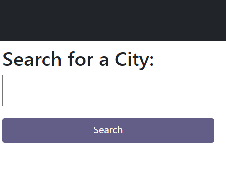
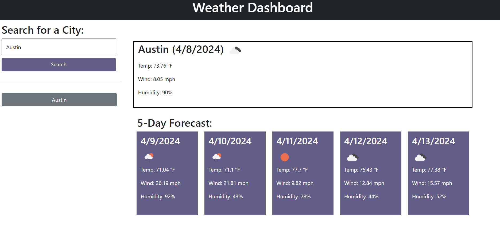

# Weather Dashboard

## Description

In this challenge, I was tasked with creating a webpage that rerieves data about the weather in an inputted city. This data had to include current weather regarding the weather conditions, temperature, wind speed, and humidity. It also had ot include a 5 day forecast with the previously mentioned information for each of the next 5 days. I was also tasked with storing previously searched city on the page as search history where the user could re-view weather information in a city they had already searched.

## Installation

To install my code, I started with making the html file for the first page. I added a header as well as an input element and search button for the user to input a city to search. I then created various div elements where I would be appending the information coming from API databases and local storage. From there, I went ahead and added placeholder elements to match the styling of the finished page I had in mind. I used this later on when adding styling to elements created in the js file. 

I then began working on the js file by fetching the first API I wanted to use for the current weather data. I then created a variable to store the needed data called 'city'. I then worked on creating a function to append that data into the html. I copied the styling I had already added to the html and moved it to my js file to do so. The next step was to retrieve the input from the input element in the html. To do so, I created an event listener to retrieve that input from a variable when the search button was clicked. I then added thatvariable into the API URL so that it would retrieve the data for that specific user inputted city. The next step was to create a function to get retrieve the data for the 5 day forecast. I did so by adding another API and implementing the coordinates fetched the from the previous API database so the cities would match. I then once again retrieved the needed data for each day and used a for loop to make sure it only retrieved from the following 5 days. My next step was to once again append that data into the html., so I created a function and copied the styling from the html and moved it to the js file. Once I saw that everything was working, my next step was to create the search history, so I went back to the frirst function to store the name of the city to an array in local storage. Now that things were being stored there, I then created a function with a for loop to append each city name in the array to the html. Finally, I finished by creating an event listener so that when a city in the search history was clicked, a function to display the weather data was run. I did this by using my first function but changing it slightly so that it didn't restore the city into local storage or re-add the city to the search history. 

## Usage

CLick on the link to see my deployed webpage https://pauldsherrill.github.io/weather-dashboard/

Once you arrive to my website you will an area where you can search for a city. 

When you enter a city and click search, a display of the current weather in that city as well as a 5-day forecast for that city are displayed. The city is also stored in the search history to revisit. 

When another city is searched for, the page will be replaced with a display of that city's weather data and that city will also be added to the search history and so on and so forth. When a previous city is clicked on in the search history, the weather data is then shown again for that city.

